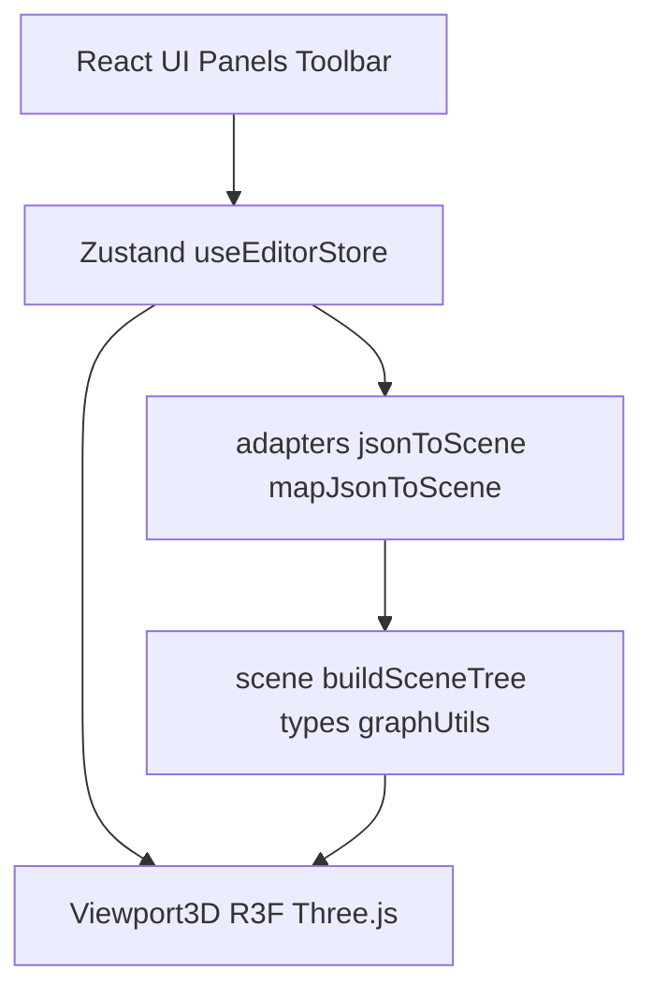

# JSON Map View — 架构设计

## 1. 概述

**JSON Map View**（npm 包名 `json-map-view`）是一个在浏览器中运行的纯前端单页应用（SPA）。用户通过本地文件选择加载 **JSON** 与 **TUM 轨迹文本**，应用将数据解析为统一的内部**场景图**（`SceneNode` 树），再用 **React Three Fiber** 在 3D 视口中绘制。

- **无后端**：数据仅通过 `File` API 读入并在客户端 `JSON.parse`，不上传服务器。
- **典型用途**：泊车 / HD Map 类 JSON 的结构化可视化、与 TUM 轨迹对齐查看、属性检查与区域筛选。

---

## 2. 技术栈

| 类别  | 选型                                                | 说明                          |
| --- | ------------------------------------------------- | --------------------------- |
| 语言  | TypeScript                                        | 严格类型，配合 `tsc -b` 与 Vite 构建  |
| 框架  | React 18                                          | UI 与 R3F 宿主                 |
| 构建  | Vite 6                                            | 开发服务器、生产打包；`@/` → `src/` 别名 |
| 3D  | Three.js + @react-three/fiber + @react-three/drei | 场景、相机、轨道控制、网格、线条与文字等        |
| 状态  | Zustand                                           | 全局编辑器状态，避免面板与画布间层层传参        |
| 布局  | react-resizable-panels                            | 可拖拽分栏，持久化 `autoSaveId`      |

静态资源 **base URL**：在 CI（如 GitHub Actions）中若存在环境变量 `GITHUB_REPOSITORY`（形如 `owner/repo`），则 `vite.config.ts` 将 `base` 设为 `/仓库名/`，以适配 GitHub Pages 项目站点的子路径；本地开发默认为 `/`。

---

## 3. 分层架构

| 层级       | 职责                                              | 主要位置                                                                    |
| -------- | ----------------------------------------------- | ----------------------------------------------------------------------- |
| **表现层**  | 工具栏、场景树、已加载文件列表、3D 视口、属性/区域面板；Godot 风格主题        | `src/App.tsx`、`src/components/*.tsx`、`src/styles/godot-theme.css`       |
| **状态层**  | 文档列表、TUM 轨迹、合并后的场景根、选中节点、隐藏集合、区域筛选、相机对焦请求、加载错误等 | `src/store/useEditorStore.ts`                                           |
| **适配层**  | JSON → `SceneNode`：通用递归或 HD Map 专用解析            | `src/adapters/jsonToScene.ts`、`src/adapters/mapJsonToScene.ts`          |
| **场景模型** | `SceneNode` 类型、合并多文件、图遍历工具                      | `src/scene/types.ts`、`buildSceneTree.ts`、`graphUtils.ts`、`constants.ts` |
| **渲染层**  | 将 `SceneNode` 映射为 Three.js 对象、拾取、选中高亮、相机同步      | `src/components/Viewport3D.tsx`、`CameraFocusSync.tsx`                   |

---

## 4. 目录与模块说明

| 路径                               | 作用                                                          |
| -------------------------------- | ----------------------------------------------------------- |
| `src/main.tsx`                   | 挂载 React 根节点，引入全局样式                                         |
| `src/App.tsx`                    | 根布局：顶栏 + 左（场景树 / 已加载文件）+ 中（3D 视口）+ 右（属性）                    |
| `src/store/useEditorStore.ts`    | 加载/移除文档与轨迹、构建 `sceneGraphRoot`、选择、可见性、区域筛选等                 |
| `src/adapters/jsonToScene.ts`    | 入口：识别 HD Map 根对象则调用 `mapJsonToScene`，否则对任意 JSON 做有界深度的递归占位树 |
| `src/adapters/mapJsonToScene.ts` | 地图 JSON 各图层解析、车体系坐标到 Three.js 的变换                           |
| `src/scene/buildSceneTree.ts`    | 多 JSON 文档 + TUM 合并为单一 `场景` 根；多文件在 XZ 平面网格排布                 |
| `src/scene/graphUtils.ts`        | 按 id 查找节点、路径、文档归属等                                          |
| `src/scene/regionMap.ts`         | `regionList` 提取与 `regionID` → 节点 id 映射（用于区域筛选）              |
| `src/utils/jsonMapFile.ts`       | 判断文件名是否为 `*json_map.json`                                   |
| `src/utils/tumTrajectory.ts`     | TUM 格式轨迹解析                                                  |
| `src/utils/roadLinkColors.ts`    | `road_links` 等线条配色                                          |

---

## 5. 数据流（简述）

1. **加载 JSON**：`File` → 文本 → `JSON.parse` → `parseJsonFileToSceneNodes` → 单文档 `SceneNode` 子树；可选提取 `regionList` 与构建 `regionIdToNodeIds`。
2. **合并场景**：`buildSceneGraphRoot` 为每个 JSON 文档生成 `type: "json"` 包装节点，并可选追加 `轨迹` 分组（TUM 折线）。
3. **UI 与画布**：`sceneGraphRoot` 驱动场景树与 `Viewport3D`；选中 id 与 Three 对象 `userData.nodeId` 一致，便于射线拾取与属性面板同步。
4. **场景树选中**：若需相机对准该节点包围盒，通过 `cameraFocusRequest` + `CameraFocusSync` 更新轨道控制器目标。

---

## 6. 核心类型：`SceneNode`

定义见 `src/scene/types.ts`。节点类型包括：`root`、`json`（单文件容器）、`group`、`mesh`、`polyline`、`parkingSlot`、`pillar` 等。`payload` 承载与业务/Inspector 相关的键值，供右侧面板展示；几何常用 `transform` 与 `polylinePoints`（Y-up 场景空间）。

---

## 7. HD Map JSON 与坐标系

- **识别**：`mapJsonToScene.ts` 中 `isMapJsonRoot` 根据根对象是否包含若干已知数组字段（如 `arrows`、`laneLines`、`road_links`、`regionList` 等）判断是否为地图 JSON。
- **坐标映射**：文件坐标约定为车体系 x 前、y 左、z 上；Three.js 为 Y-up 时映射为：**场景 X = 文件 x，场景 Y = 文件 z，场景 Z = -文件 y**（避免左右镜像并保持与视口一致）。详见 `mapJsonPointToThree` / `mapJsonDirectionToThree` 注释。
- **已实现图层**（节选）：箭头填充、车道线、减速带/斑马线端点矩形、停车位、立柱、`road_links` 及边界线等；具体以 `mapJsonToScene.ts` 中实现为准。
- **跳过键**（不展开为场景内容）：`header`、`trajectories`、`parkingSlotsOptimize`、`mapId`、`timestampNs`（常量 `MAP_JSON_SKIPPED_KEYS`）。

---

## 8. 关键业务规则

- `***json_map.json` 唯一**：文件名（不区分大小写）以 `json_map.json` 结尾时，全局仅允许一个此类文件处于已加载状态；若再加载会触发提示条（需先移除已加载地图）。详见 `isJsonMapFileName` 与 `JsonMapDuplicateNotice`。
- **重复文件**：同一 JSON 文件以「名称 + 大小 + 最后修改时间」指纹去重；TUM 以**文件名**去重。
- **区域筛选**：`regionList` 存在时，右侧面板可对某区域点击「筛选」；视口仅绘制 `payload.regionID` 与该区域 id 匹配的节点，无 `regionID` 的节点仍始终绘制。再次点击同一「筛选」可关闭筛选。

---

## 9. 扩展建议

- **新 JSON 格式**：在 `jsonToScene.ts` 增加分支或新增 adapter，将解析结果接到 `SceneNode`；尽量保持 `SceneNode` 语义稳定，仅在需要新几何/交互时扩展 `type` 或 `payload`。
- **新几何表现**：在 `Viewport3D.tsx` 中按 `SceneNode.type`（及必要时的 `payload`）增加渲染分支。
- **地图新图层**：在 `mapJsonToScene.ts` 中扩展解析，并文档化坐标与 `payload` 字段。

---

## 10. 相关文档

- [使用说明（USAGE）](./USAGE.md)
- [GitHub Pages 部署](./github-pages-deploy.md)

